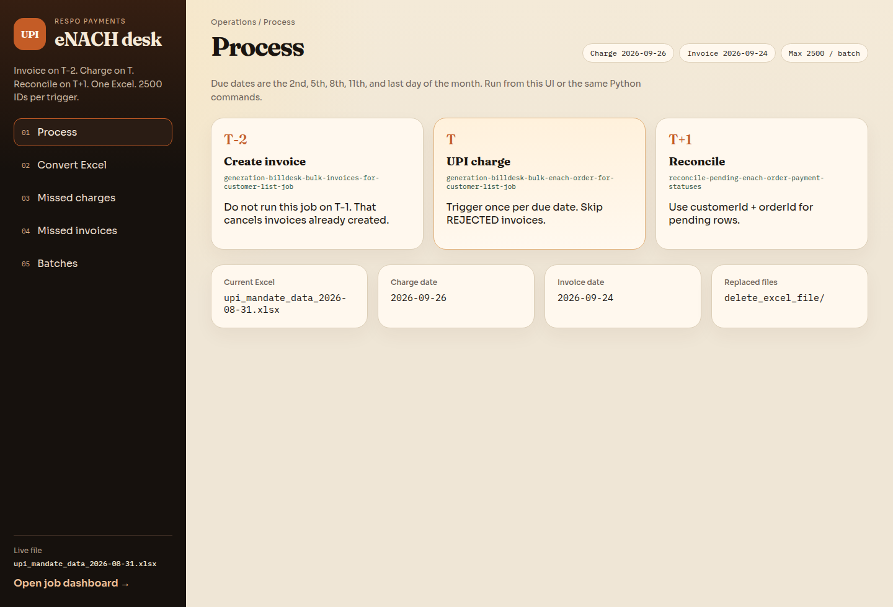
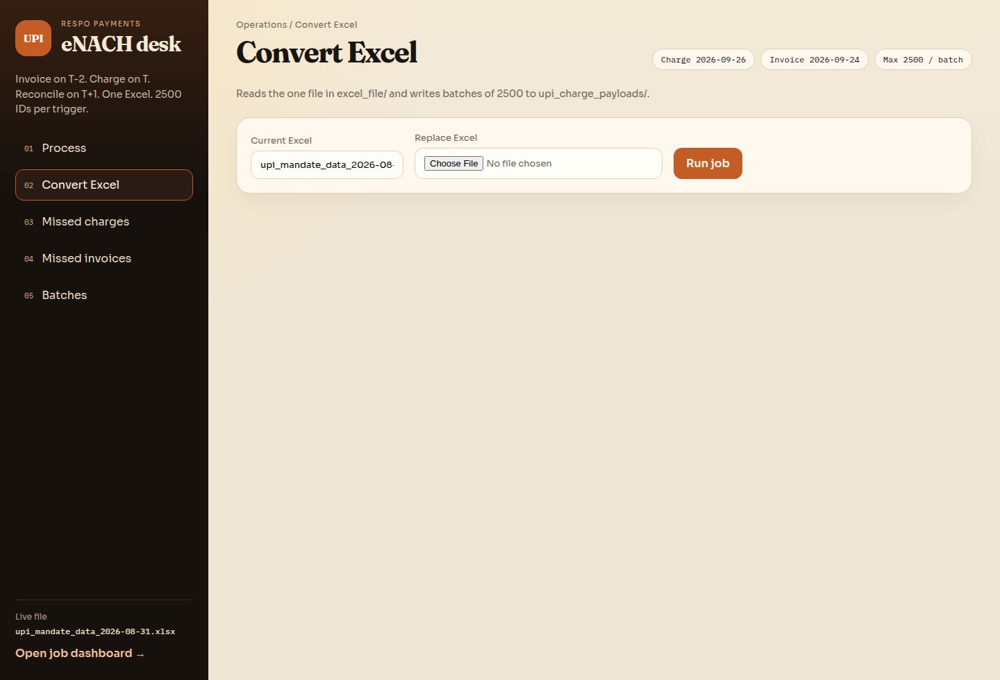
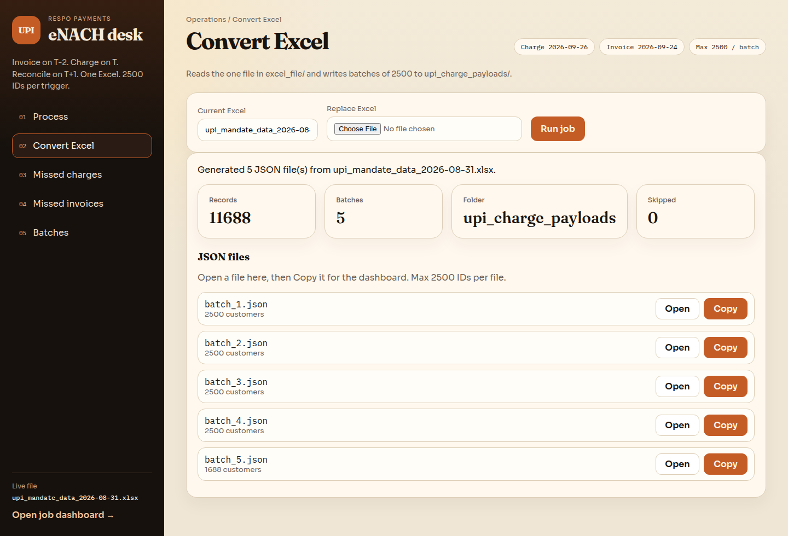
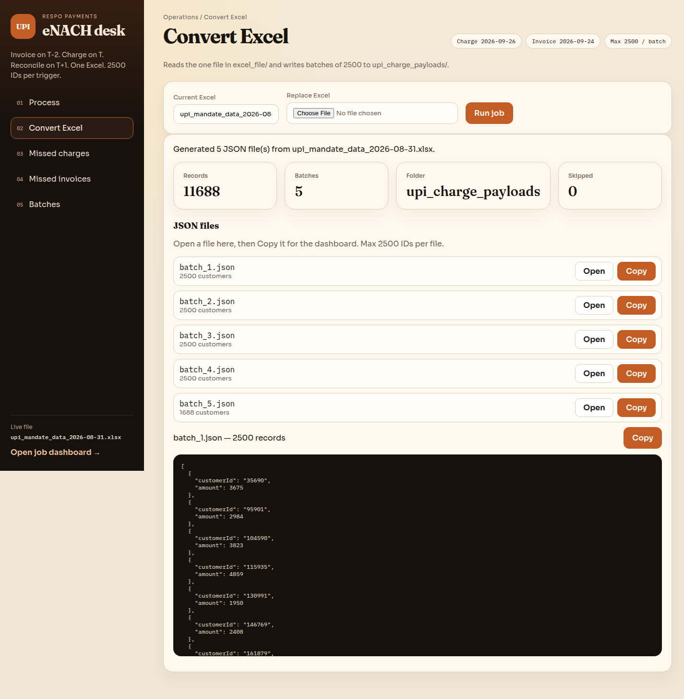
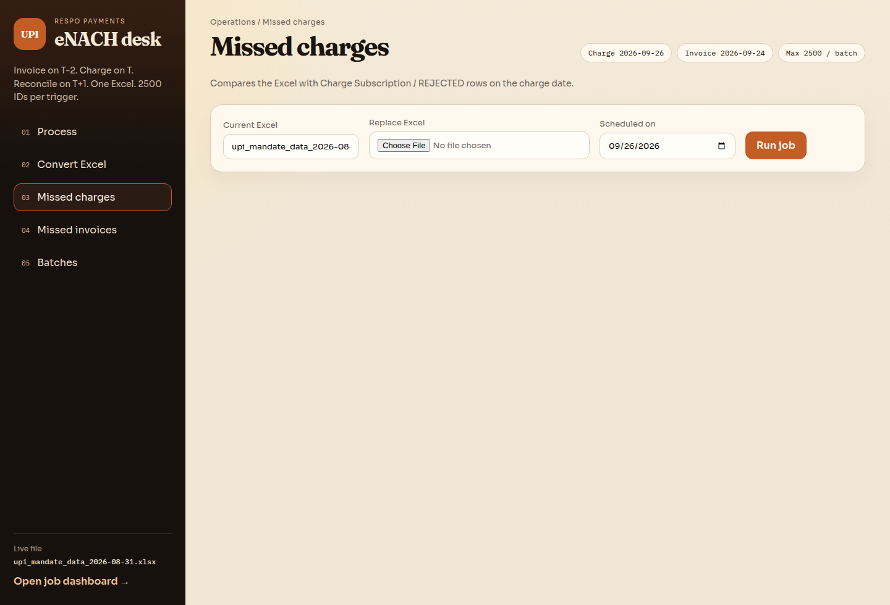
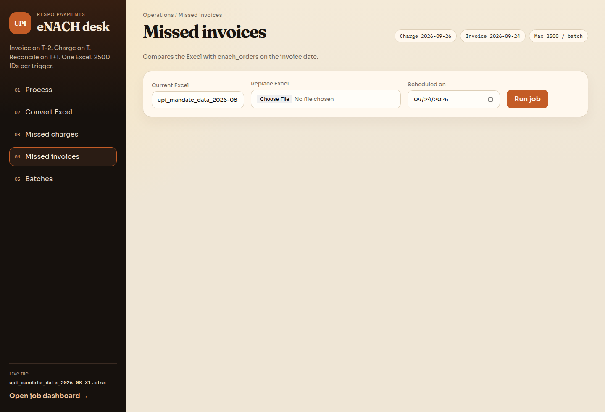
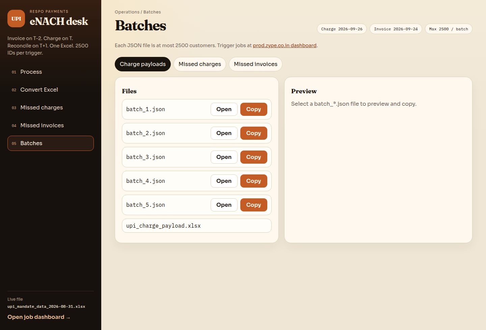

# upi-mandate-trigger

UPI eNACH process for invoice creation and charge. You can run the same jobs from the **React UI** or from the **command line**. Both use `.env`, read Excel from `excel_file/`, and write the same output folders.

## Setup from scratch

You need:

- Git
- Python 3.12 or later
- Node.js 18 or later (for the React UI)
- Network access to the payment-service MySQL replica (only for missed charge / missed invoice jobs)

### 1. Clone the repo

```bash
git clone https://github.com/Danishshaikh9702/upi-mandate-trigger.git
cd upi-mandate-trigger
```

### 2. Create a Python virtualenv and install packages

```bash
python3 -m venv .venv
.venv/bin/pip install -r requirements.txt
```

This installs `pandas`, `pymysql`, `openpyxl`, `fastapi`, and `uvicorn`.

### 3. Create `.env`

```bash
cp .env.example .env
```

Open `.env` and set your values. Do not add `.xlsx` to the Excel name.

```
UPI_EXCEL_FILE=UPI_Presentation_17th_Sep
CHARGE_SCHEDULED_ON=2026-09-26
INVOICE_SCHEDULED_ON=2026-09-24
DB_HOST=your-db-host
DB_USER=your-db-user
DB_PASSWORD=your-db-password
DB_PORT=3306
DB_NAME=payment_service
```

`.env` stays on your machine. It is not committed.

### 4. Put the presentation Excel in `excel_file/`

Keep only **one** `.xlsx` file there. The name must match `UPI_EXCEL_FILE` (without `.xlsx`).

```bash
# example: copy your BI file into the folder
cp /path/to/UPI_Presentation_17th_Sep.xlsx excel_file/
```

If you later upload a new file from the UI, the old one is moved to `delete_excel_file/`.

### 5. Install npm packages and build the UI

```bash
cd frontend
npm install
npm run build
cd ..
```

### 6. Start the UI

```bash
.venv/bin/uvicorn api:app --port 8000
```

Open **http://127.0.0.1:8000**.

### 7. Or run from the command line

You can skip the UI and run the same jobs with Python:

```bash
.venv/bin/python convert_excel_to_json.py
.venv/bin/python find_missed_upi_charges.py
.venv/bin/python find_missed_upi_invoices.py
```

### Live UI reload (optional)

If you are changing the React code, keep the API running, then in another terminal:

```bash
cd frontend
npm install
npm run dev
```

Open **http://localhost:5173**.

## Two ways to run

| | Command line | React UI |
| --- | --- | --- |
| Convert Excel | `.venv/bin/python convert_excel_to_json.py` | Convert Excel page |
| Missed charges | `.venv/bin/python find_missed_upi_charges.py` | Missed charges page |
| Missed invoices | `.venv/bin/python find_missed_upi_invoices.py` | Missed invoices page |
| Output | Same folders on disk | Same folders, plus copy JSON to the dashboard |

## Overview

This document explains the complete UPI eNACH (invoice creation and charge) process: when invoices are generated, when they are charged, and how pending payments are reconciled.

The process covers timely invoice creation, charging, and handling of rejected or pending cases. For BILLDESK and PHONEPE the invoice and charge process is the same. Only the batch job names differ; those names will be updated later.

## Due dates and invoice generation schedule

Invoices are generated two days before the due date (**T-2**). Charges run on the due date (**T**). Invoices are also generated and charged on the **11th** and the **last day** of every month.

| Item | Schedule |
| --- | --- |
| Due dates | 2nd, 5th, 8th, 11th, and last day of the month (30th / 31st) |
| Invoice generation | T-2 (example: due date 2nd → generate on 30th / 31st of the previous month) |
| UPI charge | On the due date (T) |

Do **not** run invoice creation on T-1. Running it a day before the due date cancels invoices that were already created. Invoice creation must happen on T-2 only.

## Dashboard (where jobs are triggered)

Jobs are triggered from the production dashboard:

**https://prod.zype.co.in/api/v1/dashboard/**

1. Open the dashboard.
2. Select the batch job (invoice, charge, or reconciliation).
3. Paste **one** JSON batch and trigger the job.
4. Repeat for the next batch until every file is done.

The dashboard accepts a **maximum of 2500 customer IDs** per trigger. If the list is larger, split it and run `batch_1.json`, `batch_2.json`, and so on. The scripts in this repo already write files of at most 2500 records.

Do not paste the full Excel list in one go.

## Batch jobs

| Step | Job | Trigger from |
| --- | --- | --- |
| Invoice generation | `generation-billdesk-bulk-invoices-for-customer-list-job` | [Dashboard](https://prod.zype.co.in/api/v1/dashboard/) |
| UPI charge trigger | `generation-billdesk-bulk-enach-order-for-customer-list-job` | [Dashboard](https://prod.zype.co.in/api/v1/dashboard/) |
| Reconciliation | `reconcile-pending-enach-order-payment-statuses` | [Dashboard](https://prod.zype.co.in/api/v1/dashboard/) |

## Sample payload format

Invoice creation and UPI charge use the same payload shape:

```json
[
    {"customerId": "1", "amount": 500},
    {"customerId": "2", "amount": 1000}
]
```

The scripts in this repo write that format in `batch_*.json` files. Amounts above `14999` are capped at `14999`. Each file has at most `2500` records so it can be pasted into the [dashboard](https://prod.zype.co.in/api/v1/dashboard/) in one trigger.

## Invoice creation process (T-2)

1. Prepare the customer list JSON (`customerId`, `amount`), max 2500 customers per file.
2. Open the [dashboard](https://prod.zype.co.in/api/v1/dashboard/) and trigger `generation-billdesk-bulk-invoices-for-customer-list-job` once per batch file.
3. Verify invoice creation:

```sql
SELECT *
FROM payment_service.enach_orders
WHERE payment_gateway_provider IN ('BILLDESK', 'PHONEPE')
  AND scheduled_on = 'YYYY-MM-DD 00:00:00'
  AND remark = 'Create Invoice';
```

4. Check unpaid invoices (eligible for charging):

```sql
SELECT *
FROM payment_service.enach_orders
WHERE payment_gateway_provider IN ('BILLDESK', 'PHONEPE')
  AND scheduled_on = 'YYYY-MM-DD 00:00:00'
  AND remark = 'Create Invoice'
  AND invoice_status = 'UNPAID';
```

5. Check rejected invoices:

```sql
SELECT customer_id AS customerId,
       invoice_amount AS amount,
       scheduled_on,
       invoice_status
FROM payment_service.enach_orders
WHERE payment_gateway_provider IN ('BILLDESK', 'PHONEPE')
  AND scheduled_on = 'YYYY-MM-DD 00:00:00'
  AND remark = 'Create Invoice'
  AND invoice_status = 'REJECTED';
```

6. For rejected invoices, retrigger the invoice creation job **up to 3 times**, and **only on the same day**, for those customers.

Use `find_missed_upi_invoices.py` to build the JSON for customers still missing from the presentation list.

## UPI charge process (T)

1. Receive the customer list file from BI for mandate charges.
2. Convert it to JSON with `convert_excel_to_json.py`, or use `find_missed_upi_charges.py` if some customers were already charged.
3. Open the [dashboard](https://prod.zype.co.in/api/v1/dashboard/) and trigger `generation-billdesk-bulk-enach-order-for-customer-list-job` **once per due date**, one batch file at a time (max 2500 customer IDs each).
4. Verify successful charges:

```sql
SELECT *
FROM payment_service.enach_orders
WHERE payment_gateway_provider IN ('BILLDESK', 'PHONEPE')
  AND scheduled_on = 'YYYY-MM-DD 00:00:00'
  AND remark = 'Charge Subscription'
ORDER BY created_date DESC;
```

```sql
SELECT COUNT(*)
FROM payment_service.enach_orders
WHERE payment_gateway_provider IN ('BILLDESK', 'PHONEPE')
  AND scheduled_on = 'YYYY-MM-DD 00:00:00'
  AND remark = 'Charge Subscription';
```

`find_missed_upi_charges.py` skips customers who already have a charge on that date, and customers whose `invoice_status` is `REJECTED`.

## UPI charge reconciliation (T+1)

1. On the day after charge (T+1), reconcile pending payments.
2. Open the [dashboard](https://prod.zype.co.in/api/v1/dashboard/) and run `reconcile-pending-enach-order-payment-statuses`.
3. Identify pending orders:

```sql
SELECT *
FROM payment_service.enach_orders
WHERE payment_gateway_provider IN ('BILLDESK', 'PHONEPE')
  AND scheduled_on = 'YYYY-MM-DD 00:00:00'
  AND status = 'PENDING';
```

4. Prepare the reconciliation payload:

```json
[
    {"customerId": "1", "orderId": "ORDERID..."},
    {"customerId": "2", "orderId": "ORDERID..."}
]
```

## Important notes

- Do **not** run the invoice creation job on T-1. That cancels invoices created on T-2.
- Invoice creation must happen on T-2 only.
- Trigger jobs from the [dashboard](https://prod.zype.co.in/api/v1/dashboard/). Each trigger can include at most **2500 customer IDs**.
- Trigger the UPI charge job only once per due date (one batch at a time if the list is larger than 2500).
- Retrigger rejected invoices only on the same day, at most 3 times.
- Inform DevOps not to take production deployments during this window.
- The mandate and UPI tracker sheet is no longer used.
- BILLDESK and PHONEPE follow the same invoice and charge process.

---

## Local scripts

These scripts sit in this repo. They read the BI presentation Excel from `excel_file/` and write JSON payloads for the jobs above.

### What they do

1. **Convert** the presentation Excel into JSON batches for UPI charge or invoice.
2. **Find missed charges** by comparing that Excel with `payment_service.enach_orders` for the charge date.
3. **Find missed invoices** by comparing the same Excel with orders for the invoice date.

### Project layout

| Path | Purpose |
| --- | --- |
| `excel_file/` | Current presentation Excel only (one file) |
| `delete_excel_file/` | Previous Excel files moved here when a new file is uploaded |
| `convert_excel_to_json.py` | Excel → JSON for the full list |
| `find_missed_upi_charges.py` | Customers not charged on `CHARGE_SCHEDULED_ON` |
| `find_missed_upi_invoices.py` | Customers without an invoice on `INVOICE_SCHEDULED_ON` |
| `env_loader.py` | Loads `.env` and shared Excel / DB helpers |
| `pipeline.py` | Shared convert / missed-charge / missed-invoice logic |
| `api.py` | FastAPI backend for the React UI |
| `frontend/` | React UI (Vite) |
| `docs/screenshots/` | UI screenshots used in this README |
| `.env` | Local config (not committed) |
| `.env.example` | Sample config without secrets |
| `requirements.txt` | Python packages |

Generated folders are recreated each run:

| Folder | Created by | Files |
| --- | --- | --- |
| `upi_charge_payloads/` | `convert_excel_to_json.py` | `upi_charge_payload.xlsx`, `batch_1.json`, ... |
| `missed_upi_charges/` | `find_missed_upi_charges.py` | `missed_upi_charges.xlsx`, `batch_1.json`, ... |
| `missed_upi_invoices/` | `find_missed_upi_invoices.py` | `missed_upi_invoices.xlsx`, `batch_1.json`, ... |

### Prerequisites

- Python 3.12 or later, plus Node.js 18 or later for the UI
- Network access to the payment-service MySQL replica
- Presentation Excel in `excel_file/`, with at least `customer_id` and `Final_nach_amount`

Follow **Setup from scratch** at the top of this README for clone, `pip`, `npm`, `.env`, and first run.

### Frontend steps

The React UI uses the same pipeline as the command-line scripts. After setup, start the API and use the screenshots below.

```bash
.venv/bin/uvicorn api:app --port 8000
```

6. Open **http://127.0.0.1:8000**. You land on **Process**: T-2 invoice, T charge, T+1 reconcile.



7. Open **Convert Excel**. Confirm the current file. Use **Replace Excel** if you have a new BI file. The old file moves to `delete_excel_file/`.



8. Click **Run job**. You get Records, Batches, and a list of `batch_*.json` files. Each file has **Open** and **Copy**.



9. Click **Open** to view the JSON, then **Copy**, and paste it into the [dashboard](https://prod.zype.co.in/api/v1/dashboard/). Max 2500 IDs per file.



10. Open **Missed charges**, set the date, and click **Run job**. REJECTED and already-charged customers are skipped. Copy batches the same way.



11. Open **Missed invoices**, set the invoice date, and click **Run job**.



12. Open **Batches** any time to reopen earlier JSON files and **Copy** them again.



### Configuration

```
UPI_EXCEL_FILE=UPI_Presentation_17th_Sep
CHARGE_SCHEDULED_ON=2026-09-26
INVOICE_SCHEDULED_ON=2026-09-24
DB_HOST=your-db-host
DB_USER=your-db-user
DB_PASSWORD=your-db-password
DB_PORT=3306
DB_NAME=payment_service
```

| Variable | Format | Used by | Notes |
| --- | --- | --- | --- |
| `UPI_EXCEL_FILE` | File name only | All scripts | Do not add `.xlsx`. The file must sit in `excel_file/`. |
| `CHARGE_SCHEDULED_ON` | `YYYY-MM-DD` | `find_missed_upi_charges.py` | Charge date, for example `2026-09-26` |
| `INVOICE_SCHEDULED_ON` | `YYYY-MM-DD` | `find_missed_upi_invoices.py` | Invoice date, for example `2026-09-24` |
| `DB_HOST` | Hostname | Missed scripts | Replica host |
| `DB_USER` | String | Missed scripts | Database user |
| `DB_PASSWORD` | String | Missed scripts | Quote the value if it has special characters |
| `DB_PORT` | Number | Missed scripts | Defaults to `3306` if omitted |
| `DB_NAME` | String | Missed scripts | Defaults to `payment_service` if omitted |

When you get a new presentation file, change only `UPI_EXCEL_FILE`. When the run date changes, change only the date variables.

### How to run

1. Place the Excel in `excel_file/` only. The file name must match `UPI_EXCEL_FILE`.
2. Set `CHARGE_SCHEDULED_ON` and `INVOICE_SCHEDULED_ON`.
3. Run the script you need:

```bash
.venv/bin/python convert_excel_to_json.py
.venv/bin/python find_missed_upi_charges.py
.venv/bin/python find_missed_upi_invoices.py
```

Paste each generated `batch_*.json` into the [dashboard](https://prod.zype.co.in/api/v1/dashboard/) (max 2500 customer IDs per trigger).

### `convert_excel_to_json.py`

Reads the presentation Excel and writes the full customer list as JSON. No database call.

```bash
.venv/bin/python convert_excel_to_json.py
```

### `find_missed_upi_charges.py`

Finds presentation customers who should still be charged on `CHARGE_SCHEDULED_ON`.

A customer is skipped if `enach_orders` has a row on that date that is either:

- `payment_gateway_provider` in `BILLDESK` or `PHONEPE`, and `remark = 'Charge Subscription'`, or
- `invoice_status = 'REJECTED'`

```bash
.venv/bin/python find_missed_upi_charges.py
```

### `find_missed_upi_invoices.py`

Finds presentation customers who do not have an `enach_orders` row on `INVOICE_SCHEDULED_ON`.

```bash
.venv/bin/python find_missed_upi_invoices.py
```

### How missed customers are chosen

1. Load customer IDs from `payment_service.enach_orders` for the date in `.env`.
2. Load the presentation Excel.
3. Keep Excel rows whose `customer_id` is not in that database set.
4. Recreate the output folder and write Excel + JSON.

Charge skip query:

```sql
SELECT customer_id
FROM payment_service.enach_orders
WHERE DATE(scheduled_on) = 'YYYY-MM-DD'
  AND (
    (
      payment_gateway_provider IN ('BILLDESK', 'PHONEPE')
      AND remark = 'Charge Subscription'
    )
    OR invoice_status IN ('REJECTED')
  );
```

Invoice done query:

```sql
SELECT customer_id
FROM payment_service.enach_orders
WHERE DATE(scheduled_on) = 'YYYY-MM-DD';
```

### Script notes

- Each run deletes and recreates its output folder.
- `.env` is gitignored. Use `.env.example` as the template.
- Keep only one presentation Excel in `excel_file/`. A new upload or a second file is moved to `delete_excel_file/`.
- If a script says the Excel file was not found, put the `.xlsx` in `excel_file/`.
